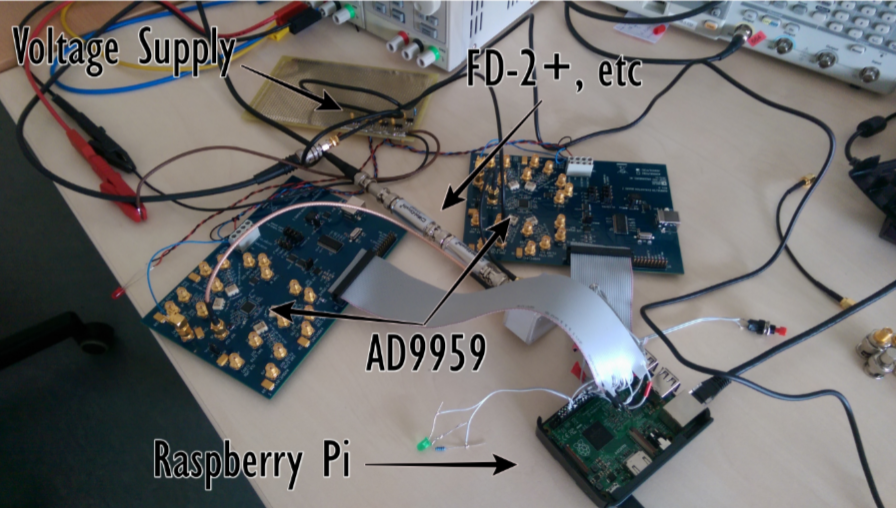
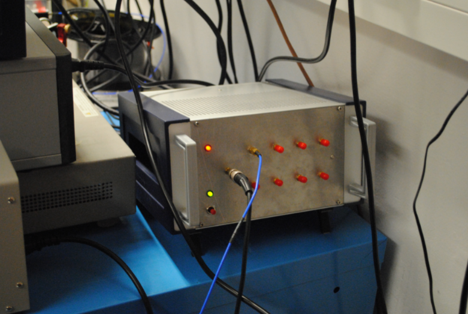

# Python Code for AD9959 DDS Chip SPI Interface

For my bachelor's thesis, I built a "DDS box" for this chip: https://www.analog.com/media/en/technical-documentation/data-sheets/ad9959.pdf


## Code

Here is some (partially cleaned) code from that:

```python
#!/usr/bin/env python

# -*- coding: utf-8 -*-

"""
AD9959 DDS Chip SPI Interface Driver
Demonstrates control of Analog Devices AD9959 4-channel DDS
"""

import spidev
import time
try:
    import RPi.GPIO as GPIO
except:
    # Mock GPIO for demonstration
    class GPIO:
        BCM = None
        OUT = None
        @staticmethod
        def setmode(mode): pass
        @staticmethod
        def setup(pin, mode): pass
        @staticmethod
        def output(pin, state): pass
        @staticmethod
        def cleanup(): pass

class AD9959:
    """AD9959 DDS Control Class"""
    
    # Register Addresses
    CSR = 0x00      # Channel Select Register
    FR1 = 0x01      # Function Register 1
    FR2 = 0x02      # Function Register 2
    CFR = 0x03      # Channel Function Register
    CFTW0 = 0x04    # Channel Frequency Tuning Word
    CPOW0 = 0x05    # Channel Phase Offset Word
    ACR = 0x06      # Amplitude Control Register
    LSRR = 0x07     # Linear Sweep Rate Register
    RDW = 0x08      # Rising Delta Word
    FDW = 0x09      # Falling Delta Word
    
    # Channel Select bits
    CH0 = 0x10
    CH1 = 0x20
    CH2 = 0x40
    CH3 = 0x80
    ALL_CHANNELS = 0xF0
    
    def __init__(self, spi_bus=0, spi_device=0, io_update_pin=17, 
                 reset_pin=27, ref_clk=25e6):
        """
        Initialize AD9959
        
        Args:
            spi_bus: SPI bus number
            spi_device: SPI device number
            io_update_pin: GPIO pin for I/O_UPDATE
            reset_pin: GPIO pin for RESET
            ref_clk: Reference clock frequency in Hz
        """
        self.spi = spidev.SpiDev()
        self.spi.open(spi_bus, spi_device)
        self.spi.max_speed_hz = 10000000  # 10 MHz SPI clock
        self.spi.mode = 0  # CPOL=0, CPHA=0
        
        self.io_update_pin = io_update_pin
        self.reset_pin = reset_pin
        self.ref_clk = ref_clk
        self.system_clk = ref_clk  # Will be updated after PLL config
        
        # Setup GPIO
        GPIO.setmode(GPIO.BCM)
        GPIO.setup(self.io_update_pin, GPIO.OUT)
        GPIO.setup(self.reset_pin, GPIO.OUT)
        
        GPIO.output(self.io_update_pin, False)
        GPIO.output(self.reset_pin, False)
        
    def reset(self):
        """Hardware reset of AD9959"""
        GPIO.output(self.reset_pin, True)
        time.sleep(0.001)
        GPIO.output(self.reset_pin, False)
        time.sleep(0.001)
        
    def io_update(self):
        """Pulse I/O_UPDATE to transfer data from buffer to active registers"""
        GPIO.output(self.io_update_pin, True)
        time.sleep(0.000001)  # 1 microsecond pulse
        GPIO.output(self.io_update_pin, False)
        time.sleep(0.000001)
        
    def write_register(self, address, data):
        """
        Write data to a register
        
        Args:
            address: Register address (0x00 to 0x18)
            data: List of bytes or single byte to write
        """
        if isinstance(data, int):
            data = [data]
        
        # Instruction byte: bit 7 = 0 (write), bits 4-0 = address
        instruction_byte = address & 0x1F
        
        # Send instruction byte followed by data
        self.spi.xfer2([instruction_byte] + list(data))
        
    def read_register(self, address, num_bytes):
        """
        Read data from a register
        
        Args:
            address: Register address
            num_bytes: Number of bytes to read
            
        Returns:
            List of bytes read
        """
        # Instruction byte: bit 7 = 1 (read), bits 4-0 = address
        instruction_byte = 0x80 | (address & 0x1F)
        
        # Send instruction byte
        self.spi.xfer2([instruction_byte])
        
        # Read data bytes
        data = self.spi.readbytes(num_bytes)
        return data
        
    def select_channel(self, channel_mask):
        """
        Select which channels to configure
        
        Args:
            channel_mask: Bit mask for channels (CH0, CH1, CH2, CH3, ALL_CHANNELS)
        """
        self.write_register(self.CSR, [channel_mask])
        # Note: Channel enable bits don't require I/O update
        
    def configure_pll(self, multiplier=20, vco_gain=0):
        """
        Configure PLL multiplier
        
        Args:
            multiplier: PLL multiplier (4-20)
            vco_gain: VCO gain control (0 or 1)
        """
        if not (4 <= multiplier <= 20):
            raise ValueError("PLL multiplier must be between 4 and 20")
        
        # FR1 register is 3 bytes
        # Byte 2 (MSB): VCO gain[23] and PLL divider[22:18]
        # Charge pump control[17:16] - typically 0b11 (75 µA)
        byte2 = (vco_gain << 7) | ((multiplier & 0x1F) << 2) | 0x03
        
        # Byte 1: Profile pin config and modulation level - use defaults
        byte1 = 0x00
        
        # Byte 0 (LSB): Various control bits - use defaults
        byte0 = 0x00
        
        self.write_register(self.FR1, [byte2, byte1, byte0])
        self.io_update()
        
        # Update system clock frequency
        self.system_clk = self.ref_clk * multiplier
        
    def set_frequency(self, channel_mask, frequency):
        """
        Set output frequency for selected channels
        
        Args:
            channel_mask: Channel selection
            frequency: Frequency in Hz
        """
        # Select channels
        self.select_channel(channel_mask)
        
        # Calculate 32-bit frequency tuning word
        # FTW = (desired_freq / system_clock) * 2^32
        ftw = int((frequency / self.system_clk) * (2**32))
        
        # Ensure FTW is within 32-bit range
        ftw = ftw & 0xFFFFFFFF
        
        # Split into 4 bytes (MSB first)
        data = [
            (ftw >> 24) & 0xFF,
            (ftw >> 16) & 0xFF,
            (ftw >> 8) & 0xFF,
            ftw & 0xFF
        ]
        
        self.write_register(self.CFTW0, data)
        self.io_update()
        
    def set_phase(self, channel_mask, phase_deg):
        """
        Set output phase for selected channels
        
        Args:
            channel_mask: Channel selection
            phase_deg: Phase in degrees (0-360)
        """
        # Select channels
        self.select_channel(channel_mask)
        
        # Calculate 14-bit phase offset word
        # POW = (phase_deg / 360) * 2^14
        pow_val = int((phase_deg / 360.0) * (2**14))
        pow_val = pow_val & 0x3FFF
        
        # Split into 2 bytes (MSB first)
        data = [
            (pow_val >> 8) & 0xFF,
            pow_val & 0xFF
        ]
        
        self.write_register(self.CPOW0, data)
        self.io_update()
        
    def set_amplitude(self, channel_mask, amplitude_scale):
        """
        Set output amplitude for selected channels
        
        Args:
            channel_mask: Channel selection
            amplitude_scale: Amplitude scale factor (0.0 to 1.0)
        """
        # Select channels
        self.select_channel(channel_mask)
        
        # Calculate 10-bit amplitude control word
        # ACR has amplitude scale factor in bits [9:0]
        # Bit 12 enables amplitude control
        acw = int(amplitude_scale * 1023)
        acw = acw & 0x3FF
        
        # Enable amplitude control (bit 12 = 1)
        acr_value = 0x1000 | acw
        
        # Split into 3 bytes (24-bit register, MSB first)
        data = [
            (acr_value >> 16) & 0xFF,
            (acr_value >> 8) & 0xFF,
            acr_value & 0xFF
        ]
        
        self.write_register(self.ACR, data)
        self.io_update()
        
    def configure_sync_master(self):
        """Configure device as synchronization master"""
        # FR2[7] = Auto sync enable
        # FR2[6] = Multidevice sync master enable
        fr2_byte1 = 0xC0  # Set bits 7 and 6
        fr2_byte0 = 0x00
        
        self.write_register(self.FR2, [fr2_byte1, fr2_byte0])
        self.io_update()
        
    def configure_sync_slave(self, clock_offset=0):
        """
        Configure device as synchronization slave
        
        Args:
            clock_offset: System clock offset (0-3) for propagation delay
        """
        # FR2[7] = Auto sync enable
        # FR2[6] = Multidevice sync master enable (0 for slave)
        # FR2[1:0] = System clock offset
        fr2_byte1 = 0x80  # Set bit 7 only
        fr2_byte0 = clock_offset & 0x03
        
        self.write_register(self.FR2, [fr2_byte1, fr2_byte0])
        self.io_update()
        
    def close(self):
        """Clean up resources"""
        self.spi.close()
        GPIO.cleanup()


# Example usage

def main():
    """Example demonstrating AD9959 control"""
    
    print("AD9959 DDS Control Example")
    print("=" * 50)
    
    # Initialize AD9959
    dds = AD9959(spi_bus=0, spi_device=0, io_update_pin=17, 
                 reset_pin=27, ref_clk=25e6)
    
    try:
        # Hardware reset
        print("Resetting AD9959...")
        dds.reset()
        time.sleep(0.1)
        
        # Configure PLL for 20x multiplication (25 MHz -> 500 MHz)
        print("Configuring PLL (20x multiplier)...")
        dds.configure_pll(multiplier=20)
        time.sleep(0.01)
        
        # Set frequency on Channel 0
        freq_ch0 = 10e6  # 10 MHz
        print(f"Setting Channel 0 to {freq_ch0/1e6:.2f} MHz...")
        dds.set_frequency(dds.CH0, freq_ch0)
        
        # Set frequency on Channel 1
        freq_ch1 = 15e6  # 15 MHz
        print(f"Setting Channel 1 to {freq_ch1/1e6:.2f} MHz...")
        dds.set_frequency(dds.CH1, freq_ch1)
        
        # Set phase offset on Channel 1 (90 degrees)
        print("Setting Channel 1 phase to 90 degrees...")
        dds.set_phase(dds.CH1, 90.0)
        
        # Set amplitude on Channel 0 (50% of full scale)
        print("Setting Channel 0 amplitude to 50%...")
        dds.set_amplitude(dds.CH0, 0.5)
        
        # Set same frequency on all channels
        freq_all = 20e6  # 20 MHz
        print(f"\nSetting all channels to {freq_all/1e6:.2f} MHz...")
        dds.set_frequency(dds.ALL_CHANNELS, freq_all)
        
        print("\nConfiguration complete!")
        
        # Example: Frequency sweep
        print("\nPerforming frequency sweep on Channel 0...")
        for freq in range(5, 25, 1):
            freq_hz = freq * 1e6
            dds.set_frequency(dds.CH0, freq_hz)
            print(f"  {freq} MHz")
            time.sleep(0.2)
            
    finally:
        # Clean up
        dds.close()
        print("\nCleaned up resources")


if __name__ == "__main__":
    main()
```

## Images 

### First Running Prototype


### Final Device

